# Hybrid FinTech Lakehouse Platform

Hybrid FinTech Lakehouse Platform is a Data Engineering portfolio project that simulates realistic banking operations and processes data through batch and streaming pipelines.

The implemented platform combines local infrastructure, Azure services and Microsoft Fabric and demonstrates:

* realistic banking data generation,
* historical transaction processing,
* Kafka-compatible event streaming,
* automated hourly batch processing,
* Parquet-based data lake storage,
* hybrid on-premises and cloud data replication,
* Microsoft Fabric and Power BI fraud analytics.

---

## Business problem

Banks receive data from multiple operational systems, including:

* payment gateways,
* ATM networks,
* core banking systems,
* CRM platforms,
* KYC/AML systems,
* fraud and risk engines,
* customer support systems,
* chargeback management systems.

Some operational events need to be processed quickly for fraud and risk monitoring. Other datasets are processed in batches for customer analytics, historical reporting and business analysis.

The project simulates these systems using Python and stores generated data in PostgreSQL.

---

## Architecture


The implemented platform contains two data processing paths.

### Streaming pipeline

```text
Simulated banking systems
→ PostgreSQL transactional outbox
→ Redpanda
→ Azure Event Hubs
→ Microsoft Fabric Eventstream
→ fraud filter
→ Eventhouse / KQL database
→ Fabric Real-Time Dashboard
→ Power BI fraud monitoring report
```

The streaming path supports both historical replay and continuously generated banking events.

Historical events are replayed from PostgreSQL to Redpanda for repeatable platform tests. A separate real-time generator creates new transactions one by one, stores them in PostgreSQL and writes matching outbox events to `banking_source.stream_events`. The outbox publisher sends only new events generated by `core_banking_realtime`, waits for Redpanda delivery confirmation and then marks each event as replayed.

The streaming pipeline processes operational banking events such as:

* card payments,
* BLIK payments,
* online payments,
* bank transfers,
* ATM withdrawals,
* transaction declines,
* suspicious device events,
* customer risk updates,
* merchant risk updates,
* high-risk transaction events.

Historical events are replayed with a fresh `event_time`, while the original source timestamp is retained as `original_event_time`.

For the continuous path, new transactions are generated every few seconds and remain permanently stored in PostgreSQL. Each transaction creates a matching outbox event that flows through Redpanda, Azure Event Hubs and Microsoft Fabric.

This makes it possible to demonstrate both historical replay and true continuously arriving operational events.

### Batch pipeline

```text
Simulated banking systems
→ PostgreSQL
→ scheduled hourly Parquet export
→ MinIO Bronze
→ scheduled hourly MinIO-to-ADLS synchronization
→ ADLS Gen2 Bronze
```

The batch path continuously exports the previous completed UTC hour. A cron job runs the wrapper script at five minutes past every hour, creating one Parquet file for the closed hourly partition without resetting or reprocessing the full historical dataset.

The batch pipeline supports:

* customer analysis,
* customer segmentation,
* transaction behavior analysis,
* account balance reporting,
* merchant risk analysis,
* chargeback analysis,
* ATM usage analysis,
* KYC/AML analysis,
* customer support analysis.

The same Bronze dataset is stored in two locations:

```text
MinIO Bronze — local on-premises copy
ADLS Gen2 Bronze — cloud copy
```

The original folder and partition structure is preserved during synchronization.

---

## Simulated source systems

The Python data generator simulates multiple banking systems.

| Source system         | Generated data                           |
| --------------------- | ---------------------------------------- |
| Core Banking System   | accounts, balances and bank transfers    |
| Payment Gateway       | card, BLIK and online payments           |
| ATM Network           | cash withdrawals and ATM activity        |
| CRM                   | customer profiles and registrations      |
| KYC/AML System        | verification and compliance checks       |
| Fraud and Risk Engine | customer, merchant and transaction risk  |
| Customer Support      | customer service and fraud-related cases |
| Chargeback System     | disputes and chargeback cases            |

---

## Generated dataset

The generated dataset covers 31 days of simulated banking activity.

| Dataset                 | Records |
| ----------------------- | ------: |
| Customers               |   5,000 |
| Accounts                |   5,820 |
| Merchants               |     800 |
| ATMs                    |     250 |
| Transactions            | 250,000 |
| Streaming events        | 259,826 |
| KYC/AML checks          |   5,000 |
| Customer risk scores    |   5,000 |
| Merchant risk scores    |     800 |
| Chargeback cases        |   2,500 |
| Customer support cases  |   2,039 |
| Device blacklist events |     729 |
| Daily account balances  | 176,745 |

Historical period:

```text
2026-05-16 → 2026-06-15
```

The dataset contains multiple:

* transaction methods,
* merchant categories,
* cities and countries,
* customer segments,
* authorization statuses,
* fraud scenarios,
* risk levels,
* banking channels,
* source systems.

---

## Streaming implementation

Operational events are stored in:

```text
banking_source.stream_events
```

The replay application reads the events from PostgreSQL and publishes them to Redpanda.

Replay script:

```text
streaming/replay_postgres_events_to_redpanda.py
```

Redpanda topic:

```text
banking.operational.events
```

The replay process:

1. reads unreplayed events from PostgreSQL,
2. preserves the historical timestamp,
3. assigns a current replay timestamp,
4. publishes the message to Redpanda,
5. waits for delivery confirmation,
6. marks successfully delivered events as replayed.

Example timestamp strategy:

```text
event_time          = current replay timestamp
original_event_time = historical source timestamp
```

### Streaming results

| Metric           |                   Result |
| ---------------- | -----------------------: |
| Processed events |                  259,826 |
| Delivered events |                  259,826 |
| Delivery errors  |                        0 |
| Replay duration  | approximately 47 minutes |

The replay process completed without delivery errors.

### Continuous real-time event generation

The real-time generator creates new banking transactions one by one without resetting historical data.

Generator:

```text
streaming/realtime_banking_generator.py
```

Transactional outbox publisher:

```text
streaming/realtime_outbox_to_redpanda.py
```

Process launcher:

```text
scripts/run_realtime_streaming.sh
```

Process stopper:

```text
scripts/stop_realtime_streaming.sh
```

Each generated transaction is written atomically to:

```text
banking_source.transactions
banking_source.stream_events
```

Only events with:

```text
source_system = core_banking_realtime
replayed_flag = false
```

are selected by the real-time outbox publisher. Historical unreplayed events are ignored by this process.

After Redpanda confirms delivery, the outbox row is updated:

```text
replayed_flag = true
replayed_at   = delivery timestamp
```

Default generation interval:

```text
2–8 seconds per transaction
```

The generated stream includes normal authorizations, declined transactions and high-risk events based on rules such as:

* `HIGH_VALUE_TRANSACTION`,
* `IMPOSSIBLE_TRAVEL`,
* `BLACKLISTED_DEVICE`,
* `VELOCITY_BREACH`,
* `UNUSUAL_GEOLOCATION`.

---

## Azure Event Hub integration

Operational banking events are consumed from Redpanda and forwarded to Azure Event Hub using a restartable Python bridge.

The bridge uses:

- manual Kafka offset commits,
- batched delivery,
- retry handling,
- per-partition offset tracking,
- offset commit only after successful Event Hub delivery.

### Full bridge result

| Metric | Result |
|---|---:|
| Consumed events | 256,906 |
| Delivered events | 256,906 |
| Committed events | 256,906 |
| Event Hub batches | 2,055 |
| Invalid events | 0 |
| Failed events | 0 |

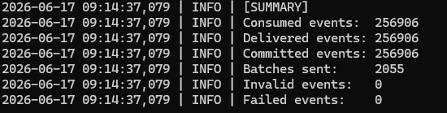

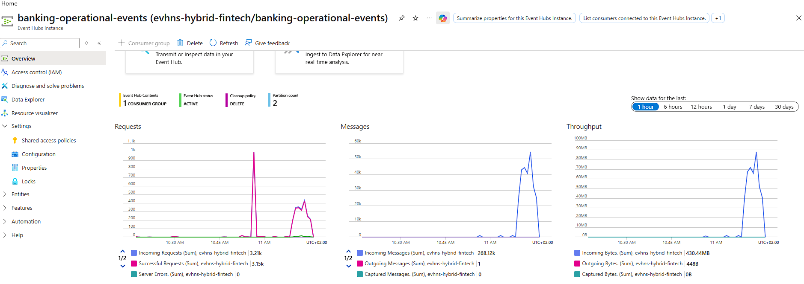

---

## Microsoft Fabric real-time fraud analytics

Azure Event Hubs is connected to Microsoft Fabric through an Eventstream.

Implemented Fabric flow:

```text
Azure Event Hubs source
→ Eventstream
→ high-risk transaction filter
→ Eventhouse destination
→ KQL analysis
```

Fabric components:

| Component | Name |
|---|---|
| Eventstream | `es-fraud-detection` |
| Event Hub source | `src-azure-eventhub-fraud` |
| Fraud filter | `flt-high-risk-transactions` |
| Eventhouse destination | `dst-eventhouse-fraud` |
| Eventhouse | `evt-fraud-analytics` |
| KQL table | `fraud_events_realtime` |

The filter forwards only:

```text
event_type = high_risk_transaction_detected
```

All incoming events remain visible in Eventstream, while only high-risk transactions are written to the Eventhouse table.

Example KQL query:

```kusto
fraud_events_realtime
| extend
    risk_score = toint(payload.risk_score),
    amount = todouble(payload.amount),
    fraud_rule = tostring(payload.fraud_rule_hit)
| summarize
    events = count(),
    avg_risk_score = round(avg(risk_score), 2),
    total_amount = round(sum(amount), 2)
  by fraud_rule
| order by events desc
```

The resulting Eventhouse dataset is used by both a Microsoft Fabric Real-Time Dashboard and a Power BI fraud monitoring report.

### Fabric evidence

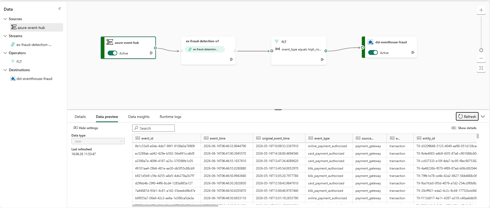

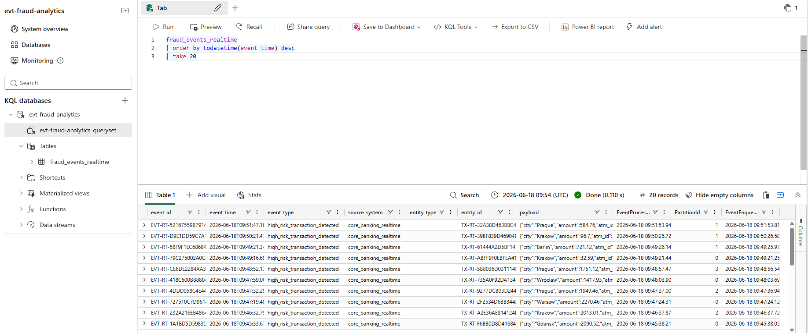

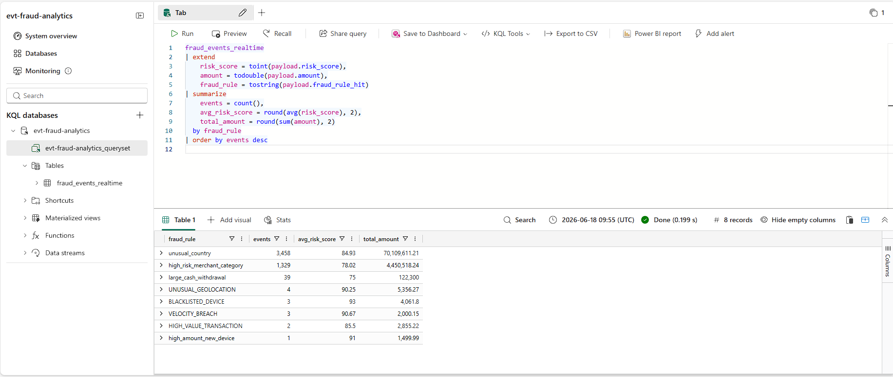

---

## Power BI fraud monitoring report

A Power BI report was created on top of the Fabric Eventhouse / KQL database to provide a business-oriented fraud monitoring layer.

Power BI report:

```text
pbi-realtime-fraud-monitoring
```

Reporting function:

```text
fraud_events_powerbi()
```

The KQL reporting function flattens the Eventhouse fraud event payload and unifies historical replay events with continuously generated real-time events.

The report combines:

```text
event_timestamp              = processing / streaming timestamp
business_event_timestamp     = original event timestamp for historical replay,
                               or processing timestamp for real-time events
source_category              = historical_replay or core_banking_realtime
```

This allows the report to analyze both historical and real-time fraud events in one model.

Main report metrics:

| Metric | Description |
|---|---|
| Total Fraud Alerts | Total number of high-risk transaction events |
| Suspicious Amount | Total suspicious transaction value |
| Average Risk Score | Average fraud risk score |
| Affected Customers | Distinct customers affected by fraud alerts |
| Affected Merchants | Distinct merchants affected by fraud alerts |

Main report visuals:

* fraud alerts over business time,
* alerts by fraud rule,
* suspicious amount by fraud rule,
* latest high-risk transactions,
* slicers for risk score, business event timestamp, fraud rule and country.

### Power BI evidence

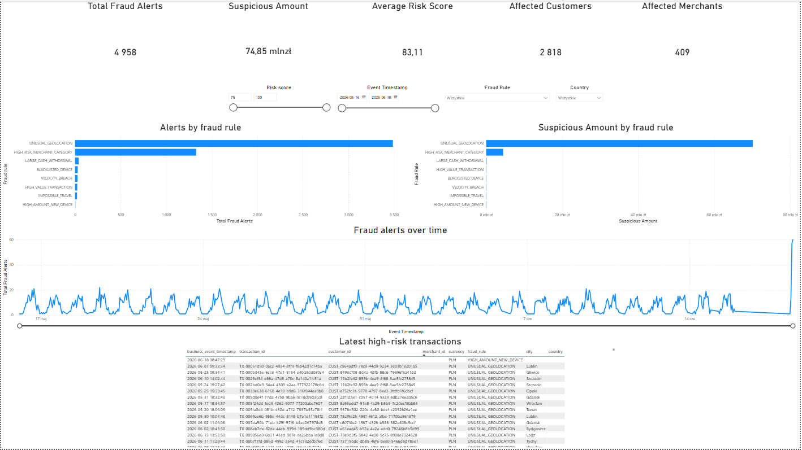

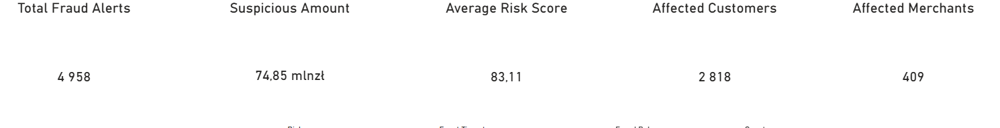

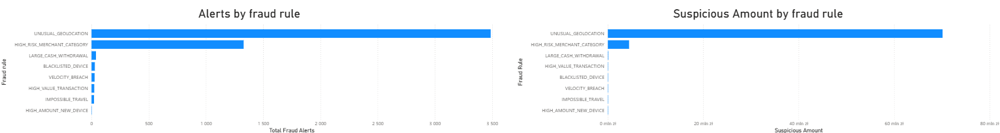

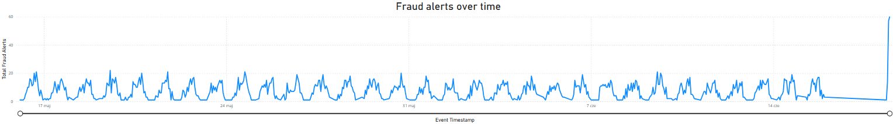

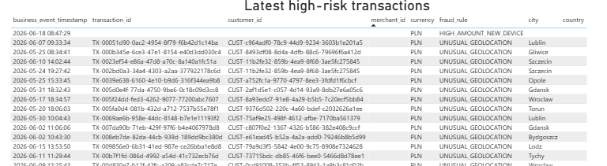

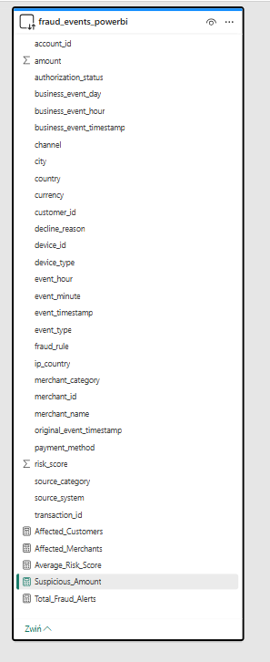

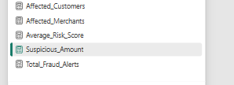

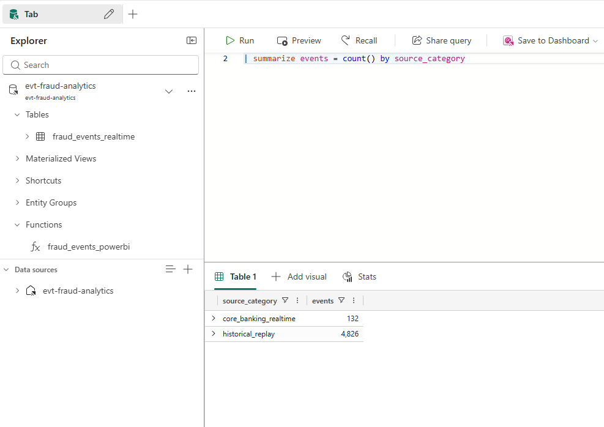

## Batch implementation

PostgreSQL datasets are exported to MinIO using:

```text
batch/export_postgres_to_minio.py
```

The exporter creates:

* hourly Parquet files,
* daily balance files,
* full reference snapshots.

File format:

```text
Parquet
```

Compression:

```text
Snappy
```

### Transaction partitioning

```text
s3://bronze/banking/transactions/
year=YYYY/
month=MM/
day=DD/
hour=HH/
transactions_YYYYMMDD_HH.parquet
```

The transaction dataset contains:

```text
31 days × 24 hours = 744 hourly files
```

### Automated hourly MinIO export

The continuous batch process exports only the previous completed UTC hour.

Wrapper script:

```text
scripts/run_hourly_minio_export.sh
```

Schedule:

```cron
5 * * * * /home/dataeng/portfolio/hybrid-fintech-lakehouse/scripts/run_hourly_minio_export.sh
```

The wrapper:

1. calculates the previous completed UTC hour,
2. prevents overlapping executions with a file lock,
3. runs the PostgreSQL-to-MinIO exporter for the hourly range,
4. skips snapshots and daily balances,
5. avoids overwriting an existing valid partition,
6. writes a dedicated execution log.

Example execution:

```text
Start:     2026-06-18T09:00:00+00:00
End:       2026-06-18T09:59:59.999999+00:00
Partition: 2026-06-18_09
Records:   171
Files:     1
```

Generated object:

```text
s3://bronze/banking/transactions/
year=2026/month=06/day=18/hour=09/
transactions_20260618_09.parquet
```

This process allows newly generated real-time transactions to be collected into hourly Bronze partitions without replaying the entire historical dataset.

### Batch export results

| Dataset                | Files | Approximate size |
| ---------------------- | ----: | ---------------: |
| Transactions           |   744 |         43.64 MB |
| Daily account balances |    31 |         15.42 MB |
| Support cases          |   548 |          1.50 MB |
| Chargebacks            |   612 |          2.42 MB |
| Customer risk scores   |     8 |          0.02 MB |
| Merchant risk scores   |   414 |          1.12 MB |
| Device blacklist       |   398 |          0.92 MB |
| Customer snapshot      |     1 |          0.35 MB |
| Account snapshot       |     1 |          0.44 MB |
| Merchant snapshot      |     1 |          0.07 MB |
| ATM snapshot           |     1 |          0.01 MB |

Total:

```text
approximately 2,764 Parquet files
approximately 65.9 MB
```

Low-volume datasets contain files only for hours in which records were generated.

---

## ADLS Gen2 synchronization

The local Bronze layer is synchronized from MinIO to Azure Data Lake Storage Gen2.

### Automated hourly ADLS synchronization

A dedicated wrapper synchronizes only the transaction partition created for the previous completed UTC hour.

Wrapper script:

```text
scripts/run_hourly_adls_sync.sh
```

Schedule:

```cron
15 * * * * /home/dataeng/portfolio/hybrid-fintech-lakehouse/scripts/run_hourly_adls_sync.sh
```

The hourly synchronization runs ten minutes after the MinIO export:

```text
:05 → PostgreSQL to MinIO hourly export
:15 → MinIO to ADLS hourly synchronization
```

The wrapper:

1. calculates the previous completed UTC hour,
2. builds the exact MinIO prefix for that partition,
3. prevents overlapping executions with a file lock,
4. synchronizes only the selected partition,
5. skips an existing Azure blob when its size matches,
6. preserves the complete object path,
7. writes a dedicated execution log.

Example synchronized prefix:

```text
banking/transactions/
year=2026/month=06/day=18/hour=10/
```

Example result:

```text
Discovered files: 1
Uploaded files:   1
Skipped files:    0
Failed files:     0
Uploaded size MB: 0.11
```

A repeated execution for the same partition is idempotent:

```text
Discovered files: 1
Uploaded files:   0
Skipped files:    1
Failed files:     0
```

This completes the automated incremental batch path:

```text
PostgreSQL
→ closed-hour Parquet export
→ MinIO Bronze
→ partition-level synchronization
→ ADLS Gen2 Bronze
```

Synchronization script:

```text
cloud/azure/minio_to_adls.py
```

Implemented features:

* paginated MinIO object discovery,
* prefix-based synchronization,
* preservation of the original object path,
* Azure container validation,
* existing file detection,
* file-size comparison,
* dry-run mode,
* overwrite mode,
* restartable synchronization,
* post-upload file-size validation,
* upload statistics and error reporting.

Data flow:

```text
MinIO bucket: bronze
→ Python synchronization
→ ADLS Gen2 container: bronze
```

Example source:

```text
s3://bronze/banking/transactions/
year=2026/month=05/day=16/hour=01/
transactions_20260516_01.parquet
```

Corresponding cloud destination:

```text
bronze/banking/transactions/
year=2026/month=05/day=16/hour=01/
transactions_20260516_01.parquet
```

The synchronization preserves the complete folder hierarchy from MinIO.

---

## Local platform evidence

### PostgreSQL source datasets


### Redpanda operational event


### MinIO hourly partitions


### Automated hourly MinIO export

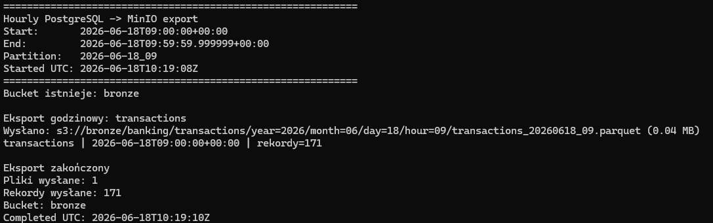

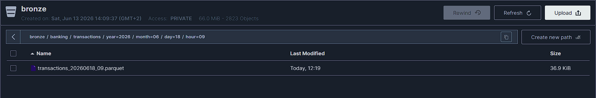

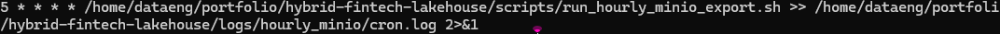

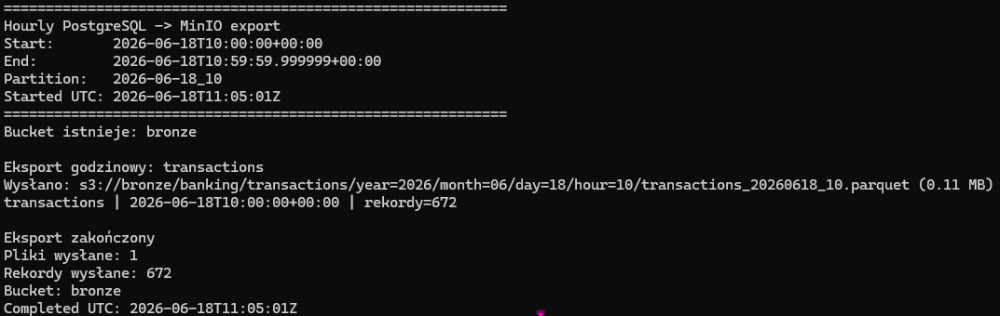

---

## Cloud platform evidence

### ADLS Gen2 Bronze structure

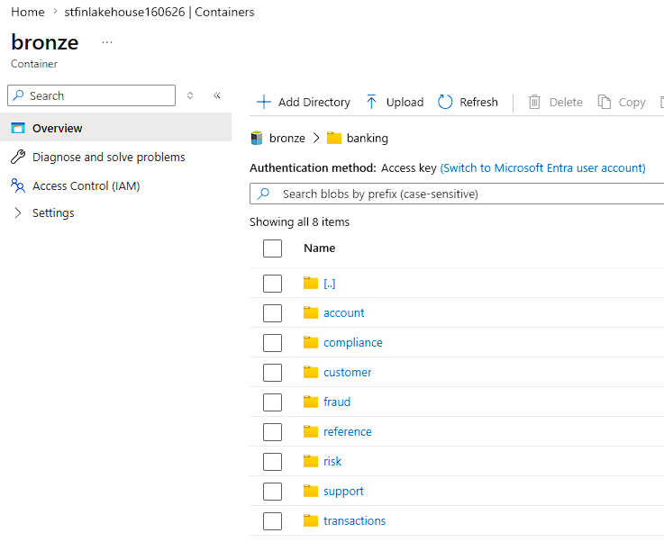

### ADLS Gen2 hourly partitions

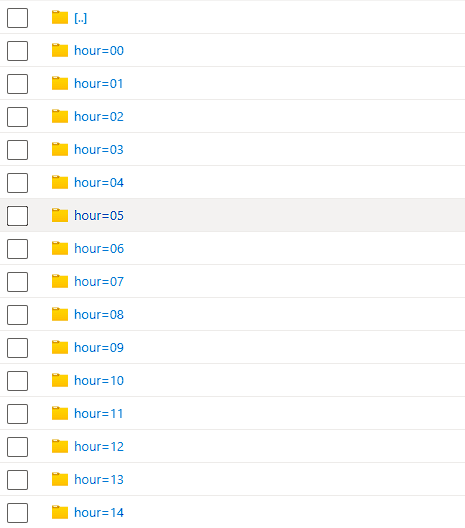

### Completed synchronization

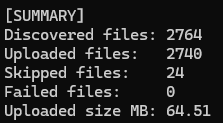

### Automated hourly ADLS synchronization

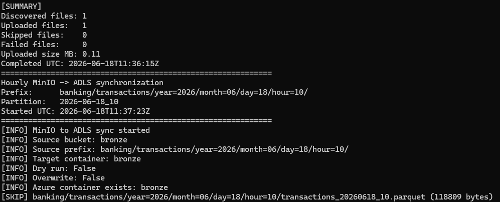

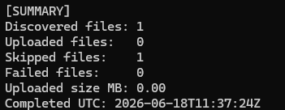

---

## Technology stack

| Area                 | Technology                   |
| -------------------- | ---------------------------- |
| Data generation      | Python                       |
| Source database      | PostgreSQL                   |
| Streaming broker     | Redpanda                     |
| Streaming API        | Apache Kafka API             |
| Local object storage | MinIO                        |
| Cloud data lake      | Azure Data Lake Storage Gen2 |
| File format          | Apache Parquet               |
| Compression          | Snappy                       |
| Local orchestration  | Docker Compose               |
| Batch scheduling      | Cron and Bash                 |
| Cloud integration    | Azure Storage SDK for Python |
| Event ingestion      | Azure Event Hubs              |
| Stream processing    | Microsoft Fabric Eventstream  |
| Real-time analytics  | Fabric Eventhouse and KQL     |
| BI integration       | Power BI Desktop report        |
| Version control      | Git and GitHub                |

---

## Implemented components

| Component                                       | Status    |
| ----------------------------------------------- | --------- |
| Historical banking data generator               | Completed |
| PostgreSQL banking source schema                | Completed |
| Realistic 31-day banking dataset                | Completed |
| PostgreSQL event replay mechanism               | Completed |
| Redpanda operational event topic                | Completed |
| Historical event replay to Redpanda             | Completed |
| Continuous banking transaction generator         | Completed |
| PostgreSQL transactional outbox publisher         | Completed |
| Redpanda to Azure Event Hubs bridge               | Completed |
| Microsoft Fabric Eventstream                      | Completed |
| Fraud event filtering                             | Completed |
| Eventhouse and KQL fraud analysis                 | Completed |
| Fabric Real-Time Fraud Dashboard                  | Completed |
| KQL reporting function for Power BI               | Completed |
| Power BI fraud monitoring report                  | Completed |
| Hourly Parquet export                           | Completed |
| Automated hourly PostgreSQL to MinIO schedule    | Completed |
| Overlap-safe hourly batch wrapper                | Completed |
| MinIO Bronze layer                              | Completed |
| ADLS Gen2 Storage Account                       | Completed |
| ADLS Gen2 Bronze container                      | Completed |
| MinIO to ADLS synchronization                   | Completed |
| Automated hourly MinIO to ADLS synchronization   | Completed |
| Partition-level incremental cloud synchronization | Completed |
| Restartable and idempotent file synchronization | Completed |
| Project documentation                           | Completed |
| Architecture Decision Records                   | Completed |

---

## Repository structure

```text
hybrid-fintech-lakehouse/
├── batch/
│   └── export_postgres_to_minio.py
├── cloud/
│   ├── __init__.py
│   └── azure/
│       ├── __init__.py
│       └── minio_to_adls.py
├── docs/
│   ├── adr/
│   ├── 01_business_scenario.md
│   ├── 02_architecture.md
│   ├── 03_data_model.md
│   ├── 04_pipeline_flow.md
│   ├── 05_bronze_silver_gold.md
│   ├── 06_local_setup.md
│   ├── 07_cloud_setup.md
│   ├── 08_data_quality.md
│   ├── 09_ci_cd_plan.md
│   └── 10_project_results.md
├── generator/
│   └── generate_historical_banking_postgres.py
├── images/
│   ├── architecture/
│   ├── batch/
│   ├── cloud/
│   ├── dashboards/
│   ├── local/
│   └── streaming/
├── sql/
│   └── source/
│       └── 01_banking_source_schema.sql
├── scripts/
│   ├── run_hourly_adls_sync.sh
│   ├── run_hourly_minio_export.sh
│   ├── run_realtime_streaming.sh
│   └── stop_realtime_streaming.sh
├── streaming/
│   ├── replay_postgres_events_to_redpanda.py
│   ├── realtime_banking_generator.py
│   └── realtime_outbox_to_redpanda.py
├── docker-compose.yml
├── requirements.txt
└── README.md
```

---

## Documentation

Detailed documentation is available in the `docs` directory:

* [Business scenario](docs/01_business_scenario.md)
* [Architecture](docs/02_architecture.md)
* [Data model](docs/03_data_model.md)
* [Pipeline flow](docs/04_pipeline_flow.md)
* [Bronze, Silver and Gold architecture](docs/05_bronze_silver_gold.md)
* [Local setup](docs/06_local_setup.md)
* [Cloud setup](docs/07_cloud_setup.md)
* [Data quality](docs/08_data_quality.md)
* [CI/CD design](docs/09_ci_cd_plan.md)
* [Project results](docs/10_project_results.md)
* [Microsoft Fabric Real-Time Fraud Dashboard](docs/11_fabric_realtime_dashboard.md)
* [Power BI Fraud Monitoring Report](docs/12_powerbi_fraud_monitoring.md)
* [Architecture Decision Records](docs/adr/)

---

## Key engineering concepts demonstrated

* hybrid on-premises and cloud data architecture,
* batch and streaming data processing,
* realistic banking data simulation,
* historical event replay,
* event-time and processing-time handling,
* Kafka-compatible event streaming,
* continuously generated banking events,
* transactional outbox pattern,
* Azure Event Hubs integration,
* Microsoft Fabric Eventstream processing,
* real-time fraud filtering,
* Eventhouse and KQL analytics,
* Power BI DirectQuery reporting,
* unified business-time and processing-time analytics,
* idempotent event delivery,
* restartable data pipelines,
* cron-based batch scheduling,
* overlap prevention with file locking,
* incremental export of closed hourly windows,
* partition-level MinIO-to-ADLS synchronization,
* idempotent hourly cloud replication,
* hourly Parquet partitioning,
* Snappy compression,
* S3-compatible object storage,
* ADLS Gen2 cloud storage,
* local and cloud Bronze layers,
* source-to-data-lake synchronization,
* deterministic object paths,
* data reconciliation,
* data quality validation,
* architecture decision documentation.

---

## Engineering outcomes

The project successfully demonstrates two end-to-end hybrid data flows:

```text
Real-time path:
Banking transaction generator
→ PostgreSQL transactional outbox
→ Redpanda
→ Azure Event Hubs
→ Microsoft Fabric Eventstream
→ Eventhouse / KQL
→ Fabric Real-Time Dashboard
→ Power BI fraud monitoring report
```

```text
Batch path:
Banking data simulation
→ PostgreSQL source system
→ scheduled closed-hour Parquet export
→ MinIO local Bronze
→ scheduled partition-level synchronization
→ ADLS Gen2 cloud Bronze
```

The platform contains:

* 250,000 banking transactions,
* 259,826 operational events,
* 31 days of historical activity,
* 744 historical hourly transaction partitions,
* continuously created hourly partitions for new transactions,
* automated hourly replication of new transaction partitions to ADLS Gen2,
* approximately 2,764 Parquet files,
* complete local and cloud Bronze storage,
* zero Redpanda replay delivery errors,
* Power BI report for historical and real-time fraud monitoring.
