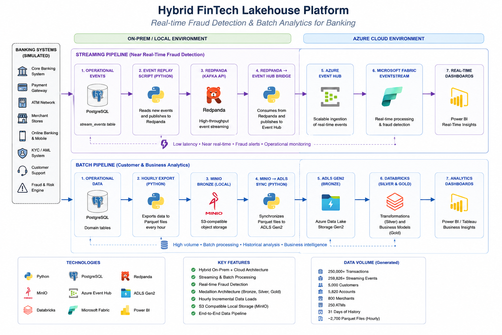
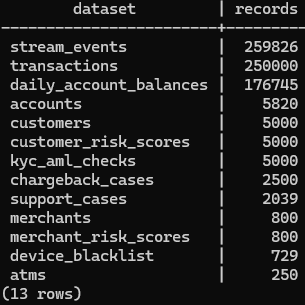
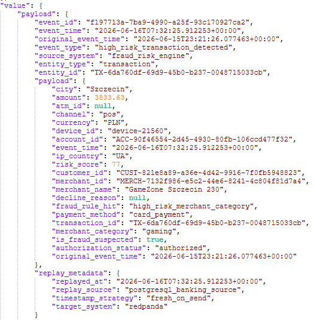
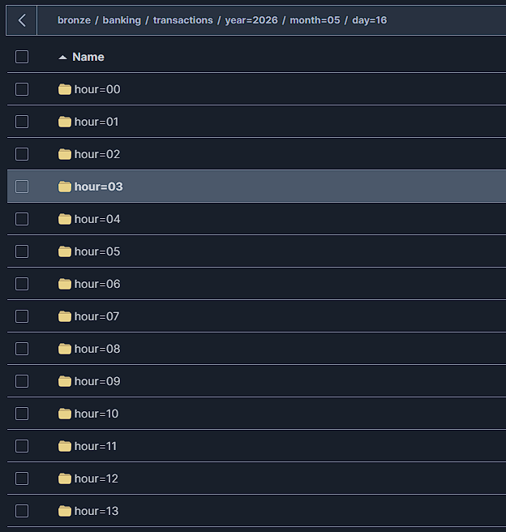

# Hybrid FinTech Lakehouse Platform

Hybrid FinTech Lakehouse Platform is a portfolio Data Engineering project that simulates realistic banking operations and processes data through two parallel pipelines:

* near real-time fraud detection,
* batch customer and risk analytics.

The platform combines on-premises components with Microsoft Azure services and demonstrates a hybrid batch and streaming architecture.

---

## Business problem

A bank receives data from multiple operational systems, including:

* payment gateways,
* ATM networks,
* core banking systems,
* CRM platforms,
* KYC/AML systems,
* fraud and risk engines,
* customer support systems,
* chargeback management systems.

Some events must be analyzed almost immediately for fraud detection and operational monitoring. Other datasets are processed in hourly batches for customer analytics, historical reporting, risk analysis and business intelligence.

---

## Architecture



The platform uses two independent processing paths.

### Streaming pipeline

```text
PostgreSQL
→ Python event replay
→ Redpanda
→ Python Event Hub bridge
→ Azure Event Hub
→ Microsoft Fabric Eventstream
→ Real-Time Intelligence
→ Power BI
```

The streaming pipeline is designed for near real-time processing of:

* card payments,
* BLIK payments,
* online payments,
* bank transfers,
* ATM withdrawals,
* transaction declines,
* suspicious devices,
* high-risk transactions,
* customer and merchant risk changes.

Historical events are replayed with a fresh `event_time`, while the original source timestamp is retained as `original_event_time`.

### Batch pipeline

```text
PostgreSQL
→ hourly Parquet export
→ MinIO Bronze
→ MinIO to ADLS synchronization
→ ADLS Gen2 Bronze
→ Databricks Bronze
→ Databricks Silver
→ Databricks Gold
→ Power BI / Tableau
```

The batch pipeline supports:

* customer 360 analysis,
* customer segmentation,
* transaction behavior analysis,
* account balance reporting,
* merchant risk analysis,
* chargeback analysis,
* ATM usage analysis,
* KYC/AML reporting.

---

## Simulated source systems

The Python generator simulates multiple banking systems:

| Source system         | Generated data                      |
| --------------------- | ----------------------------------- |
| Core Banking System   | accounts, balances, transfers       |
| Payment Gateway       | card, BLIK and online payments      |
| ATM Network           | cash withdrawals                    |
| CRM                   | customer profiles and registrations |
| KYC/AML System        | verification and compliance checks  |
| Fraud and Risk Engine | risk scores and fraud indicators    |
| Customer Support      | service and fraud-related cases     |
| Chargeback System     | disputes and chargeback cases       |

---

## Generated dataset

The current dataset covers 31 days of simulated banking activity.

| Dataset                 | Records |
| ----------------------- | ------: |
| Customers               |   5,000 |
| Accounts                |   5,820 |
| Merchants               |     800 |
| ATMs                    |     250 |
| Transactions            | 250,000 |
| Streaming events        | 259,826 |
| KYC/AML checks          |   5,000 |
| Customer risk scores    |   5,000 |
| Merchant risk scores    |     800 |
| Chargeback cases        |   2,500 |
| Customer support cases  |   2,039 |
| Device blacklist events |     729 |
| Daily account balances  | 176,745 |

Historical period:

```text
2026-05-16 → 2026-06-15
```

---

## Streaming results

The historical event replay from PostgreSQL to Redpanda completed successfully.

| Metric           |                   Result |
| ---------------- | -----------------------: |
| Processed events |                  259,826 |
| Delivered events |                  259,826 |
| Delivery errors  |                        0 |
| Replay duration  | approximately 47 minutes |

Redpanda topic:

```text
banking.operational.events
```

---

## Batch export results

PostgreSQL datasets were exported to MinIO as Parquet files compressed with Snappy.

| Dataset                | Files |
| ---------------------- | ----: |
| Transactions           |   744 |
| Daily account balances |    31 |
| Support cases          |   548 |
| Chargebacks            |   612 |
| Merchant risk scores   |   414 |
| Device blacklist       |   398 |
| Customer snapshot      |     1 |
| Account snapshot       |     1 |
| Merchant snapshot      |     1 |
| ATM snapshot           |     1 |

Transaction partitioning:

```text
s3://bronze/banking/transactions/
year=YYYY/month=MM/day=DD/hour=HH/
```

The 744 transaction files represent:

```text
31 days × 24 hours
```

---

## Local platform evidence

### PostgreSQL source datasets



### Redpanda operational event



### MinIO hourly partitions



Screenshots are added only after the related component has been implemented and validated.

---

## Technology stack

| Area                  | Technology                   |
| --------------------- | ---------------------------- |
| Data generation       | Python                       |
| Source database       | PostgreSQL                   |
| Streaming broker      | Redpanda                     |
| Local object storage  | MinIO                        |
| Cloud event ingestion | Azure Event Hub              |
| Cloud data lake       | ADLS Gen2                    |
| Real-time analytics   | Microsoft Fabric Eventstream |
| Lakehouse processing  | Databricks                   |
| File format           | Parquet                      |
| Compression           | Snappy                       |
| Reporting             | Power BI / Tableau           |
| Local orchestration   | Docker Compose               |
| Version control       | GitHub                       |

---

## Project status

| Component                          | Status    |
| ---------------------------------- | --------- |
| PostgreSQL source system           | Completed |
| Historical banking generator       | Completed |
| Redpanda replay pipeline           | Completed |
| MinIO hourly Parquet export        | Completed |
| Azure Event Hub connectivity test  | Completed |
| Redpanda to Event Hub bridge       | Completed |
| MinIO to ADLS Gen2 synchronization | Completed |
| Microsoft Fabric Eventstream       | Completed |
| Databricks Bronze/Silver/Gold      | Completed |
| Power BI dashboards                | Completed |
| CI/CD                              | Completed |

---

## Repository structure

```text
hybrid-fintech-lakehouse/
├── batch/
│   └── export_postgres_to_minio.py
├── cloud/
│   └── azure/
├── databricks/
├── docs/
│   ├── adr/
│   ├── 01_business_scenario.md
│   ├── 02_architecture.md
│   ├── 03_data_model.md
│   ├── 04_pipeline_flow.md
│   ├── 05_bronze_silver_gold.md
│   ├── 06_local_setup.md
│   ├── 07_cloud_setup.md
│   ├── 08_data_quality.md
│   ├── 09_ci_cd_plan.md
│   └── 10_project_results.md
├── generator/
│   └── generate_historical_banking_postgres.py
├── images/
├── sql/
│   └── source/
├── streaming/
│   └── replay_postgres_events_to_redpanda.py
├── docker-compose.yml
└── README.md
```

---

## Documentation

Detailed documentation is available in the `docs` directory:

* [Business scenario](docs/01_business_scenario.md)
* [Architecture](docs/02_architecture.md)
* [Data model](docs/03_data_model.md)
* [Pipeline flow](docs/04_pipeline_flow.md)
* [Bronze, Silver and Gold layers](docs/05_bronze_silver_gold.md)
* [Local setup](docs/06_local_setup.md)
* [Cloud setup](docs/07_cloud_setup.md)
* [Data quality](docs/08_data_quality.md)
* [CI/CD plan](docs/09_ci_cd_plan.md)
* [Project results](docs/10_project_results.md)
* [Architecture Decision Records](docs/adr/)

---

## Key engineering concepts demonstrated

* hybrid on-premises and cloud architecture,
* batch and streaming processing,
* historical event replay,
* event-time and processing-time handling,
* Kafka-compatible event streaming,
* hourly Parquet partitioning,
* local and cloud Bronze layers,
* medallion architecture,
* restartable pipelines,
* idempotent message delivery,
* data quality and reconciliation,
* realistic banking data simulation.


